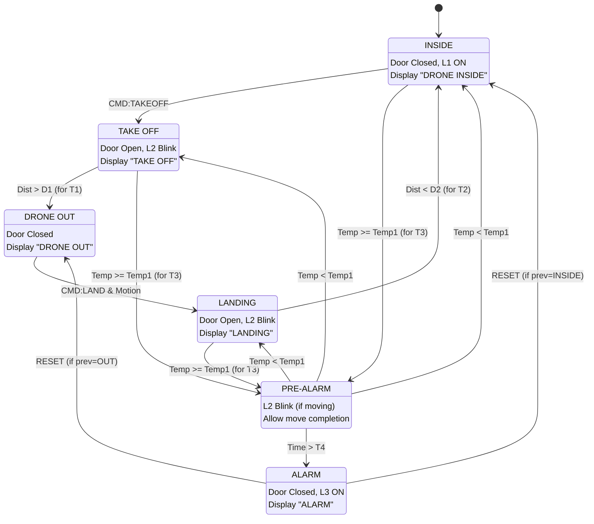

# Smart Drone Hangar

## 1. Introduction
This project implements an embedded system for an automated drone hangar. The system consists of two main subsystems communicating via serial line:
1.  **Drone Hangar (Arduino):** Manages sensors, actuators, and control logic.
2.  **Drone Remote Unit (PC):** A GUI for remote control and telemetry monitoring.

## 2. System Architecture (Drone Hangar)
The Arduino code follows a **Task-Based Architecture** with a **Cooperative Scheduler**.

The scheduler executes tasks based on a **50ms** base tick:

* **SensingTask (Period: 50ms):** Acquires data from sensors (Sonar, Temperature, PIR) and updates the shared `Context`.
* **LogicTask (Period: 100ms):** Implements the **Finite State Machine (FSM)**. It controls the actuators (Servo, LEDs, LCD) based on the system state and sensor data.
* **CommTask (Period: 200ms):** Handles asynchronous serial communication with the PC (receiving commands, sending telemetry).

## 3. Finite State Machine (FSM)
The FSM (implemented in `LogicTask`) manages the system behavior through the following states:

* **INSIDE:** Initial state. Door closed, waiting for takeoff command.
* **TAKEOFF:** Door open, LED L2 blinking. Transitions to *DroneOut* when distance > D1.
* **DRONEOUT:** Drone is outside. Door closed. Waiting for landing command and PIR detection.
* **LANDING:** Door open, LED L2 blinking. Transitions to *Inside* when distance < D2.
* **PREALARM:** Triggered by `Temp1`. Suspends new operations but **allows ongoing takeoff/landing to complete**.
* **ALARM:** Triggered by `Temp2` or timeout. **Immediately closes the door** for safety, activates LED L3 (Red), and locks the system until the RESET button is pressed.

## 4. Drone Remote Unit (PC Subsystem)
The PC application is developed in **Java** using **Swing** for the GUI and **JSSC** for Serial Communication. It follows the **Observer pattern** to separate the UI (`DRUView`) from the logic (`DRUController`). It allows operators to send Takeoff/Land commands and view real-time telemetry (State, Distance, Temp, Motion).